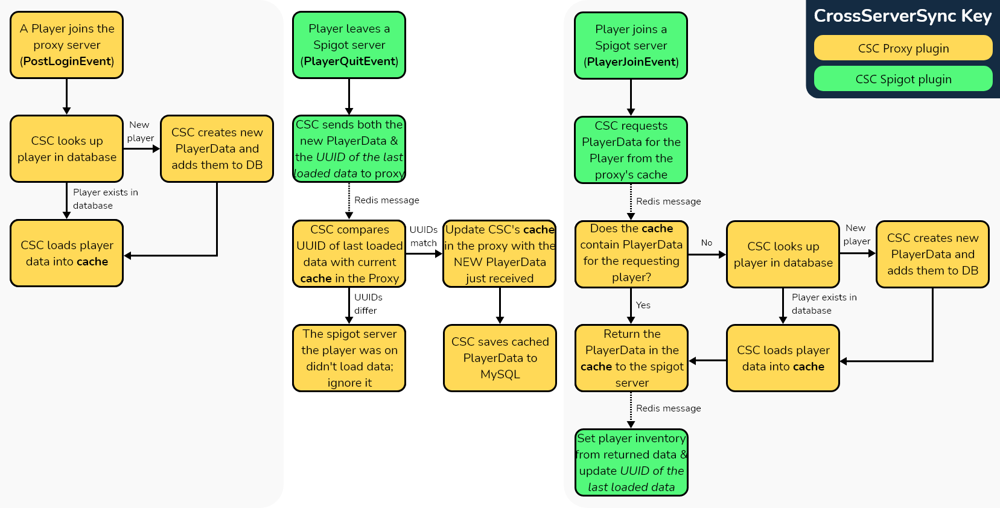

[](https://github.com/WiIIiam278/HuskSync)
# HuskSync
[](https://discord.gg/tVYhJfyDWG)

**HuskSync** is a modern, cross-server player data synchronisation system that allows player data (inventories, health, hunger & status effects) to be synchronised across servers through the use of **Redis**. 

## Disclaimer
This source code is provided as reference to licensed individuals that have purchased the HuskSync plugin once from any of the official sources it is provided. The availability of this code does not grant you the rights to re-distribute, compile or share this source code outside this intended purpose. 

Are you a developer? [Read below for information about code bounty licensing](#Contributing).

## Setup
### Requirements
* A BungeeCord-based proxy server
* A Spigot-based game server
* A Redis server

### Installation
1. Install HuskSync in the `/plugins/` folder of both your Spigot and Proxy servers.
2. Start your servers, then stop them again to allow the configuration files to generate.  
3. Navigate to the generated `config.yml` files on your Spigot server and Proxy (located in `/plugins/HuskSync/`) and fill in the credentials of your redis server. 
   1. On the Proxy server, you can additionally configure a MySQL database to save player data in, as by default the plugin will create a SQLite database. 
   2. If you have multiple proxy servers (i.e. via RedisBungee), you need to install the plugin on all of them and make use of the MySQL option and ensure the proxies are using the same database.
   3. By default, everything except player locations are synchronised. If you would like to change what gets synchronised, you can do this by editing the `config.yml` files of each Spigot server.
4. Once you have finished setting everything up, make sure to restart all of your servers and proxy server. Then, log in and data should be synchronised!

### Migration from MySQLPlayerDataBridge
HuskSync supports the migration of player data from [MySQLPlayerDataBridge](https://www.spigotmc.org/resources/mysql-player-data-bridge.8117/). Please note that HuskSync is not compatible with MySQLPlayerInventoryBridge, as that has a different system for data handling.

To migrate from MySQLPLayerDataBridge, you need a Proxy server with HuskSync installed and one Spigot server with both HuskSync and MySQLPlayerDataBridge installed. To migrate:
1. Make sure HuskSync is set up correctly on the Proxy and Spigot server, making sure that the two are able to communicate with Redis (it will display a handshake confirmation message in both consoles when communications have been established)
2. Make sure your database is configured correctly on your Proxy server. For example, if you would like to change from SQLite to MySQL, you should do this now because the data from MySQLPlayerDataBridge will be moved into it.
3. Make sure no players are online, then in the Proxy server's console run `husksync migrate`
4. Follow the steps in the Migration wizard to ensure the connection credentials and details of the database containing your MySQLPlayerDataBridge are correct, changing settings with `husksync migrate setting <setting> <new value>` as necessary.
5. Run `husksync migrate start` in the Proxy server's console to start the migration. This could take some time, depending on the amount of data that needs migrating and the speed of your database/server. When the migration is complete, it will display a "Migration complete" message. 

## How it works

HuskSync saves a player's data when they log out to a cache on your proxy server, and redistributes that data to players when they join another HuskSync-enabled server. Player data in the cache is then saved to a database (be it SQLite or MySQL) and this is loaded from when a player joins your network.

To facilitate the transfer of data between servers, HuskSync serializes player data and then makes use of Redis to communicate between the Proxy and Spigot servers.

### What is synchronised
Everything except player locations are synchronised by default. You can enable or disable what data is loaded on a server by modifying these values in the `/plugins/HuskSync/config.yml` file on each Spigot server.
* Player inventory
   * Player armour and off-hand
   * Player currently selected hotbar slot
* Player ender chest
* Player experience points & levels
* Player health
   * Player max health
   * Player health scale
* Player hunger
   * Player saturation
   * Player exhaustion
* Player game mode
* Player advancements
* Player statistics (ESC → Statistics menu)
* Player location
   * Player flight status 

### Commands
Commands are handled by the proxy server, rather than each spigot server. Some will only work on Spigot servers with HuskSync installed. Please remember that you will need a Proxy permission plugin (e.g. LuckPermsBungee) to set permissions for proxy commands.

Command | Description | Permission
------- | ----------- | ----------
`/husksync about`  | View plugin information | N/A
`/husksync status` | View system status information | `husksync.command.admin`
`/husksync reload` | Reload config & message files | `husksync.command.admin`
`/husksync invsee` | View an offline player's inventory | `husksync.command.inventory`
`/husksync echest` | View an offline player's ender chest | `husksync.command.ender_chest`

## Developers
### API
Coming soon!

### Contributing
A code bounty program is in place for HuskSync, where developers making significant code contributions to HuskSync may be entitled to a discretionary license to use HuskSync in commercial contexts without having to purchase the resource, so please feel free to submit pull requests with improvements, fixes and features!

### Building
To build HuskSync you will first need to download MySqlPlayerDataBridge and `mvn install:install-file` the jar file to your local maven repository.
```
mvn install:install-file -Dfile=MysqlPlayerDataBridge-v3.36.3.jar -DgroupId=net.craftersland.data -DartifactId=bridge -Dversion=3.36.3 -Dpackaging=jar
```

Then, to build the plugin, run the following in the root of the repository:
```
./gradlew clean build
```