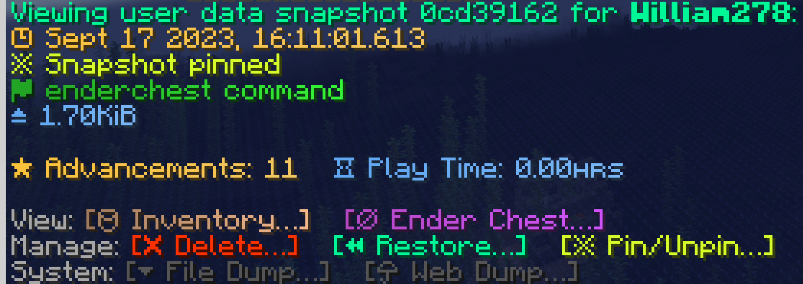

# [](https://github.com/WiIIiam278/HuskSync)
[](https://github.com/WiIIiam278/HuskSync/actions/workflows/java_ci.yml)
[](https://jitpack.io/#net.william278/HuskSync)
[](https://discord.gg/tVYhJfyDWG)

[Documentation, Guides & API](https://william278.net/docs/husksync) · [Resource Page](https://www.spigotmc.org/resources/husksync.97144/) · [Bug Reports](https://github.com/WiIIiam278/HuskSync/issues)

**HuskSync** is a modern, cross-server player data synchronisation system that enables the comprehensive synchronisation of your user's data across multiple proxied servers. It does this by making use of Redis and MySQL to optimally cache data while players change servers.

## Features


- Synchronise inventories, ender chests, advancements, statistics, experience points, health, max health, hunger, saturation, potion effects, persistent data container tags, game mode, location and more across multiple proxied servers. 
- Create and manage "snapshot" backups of user data and roll back users to previous states on-the-fly. (`/userdata`)
- Preview, list, delete, restore & pin user data snapshots in-game with an intuitive menu.
- Examine the contents of player's inventories and ender chests on-the-fly. (`/inventory`, `/enderchest`)
- Hooks with your [Player Analytics](https://github.com/plan-player-analytics/Plan) web panel to provide an overview of user data.
- Supports segregating synchronisation across multiple distinct clusters on one network.

## Requirements
* A MySQL Database (v8.0+).
* A Redis Database (v5.0+)
* Any number of proxied Spigot servers (Minecraft v1.16.5+)

## Setup
1. Place the plugin jar file in the `/plugins/` directory of each Spigot server. You do not need to install HuskSync as a proxy plugin.
2. Start, then stop every server to let HuskSync generate the config file.
3. Navigate to the HuskSync config file on each server (`~/plugins/HuskSync/config.yml`) and fill in both the MySQL and Redis database credentials.
4. Start every server again and synchronization will begin.

## Building
To build HuskSync, simply run the following in the root of the repository:
```
./gradlew clean build
```

## License
HuskSync is a premium resource. This source code is provided as reference only for those who have purchased the resource from an official source.

- [License](https://github.com/WiIIiam278/HuskSync/blob/master/LICENSE)

## Contributing
A code bounty program is in place for HuskSync, where developers making significant code contributions to HuskSync may be entitled to a license at my discretion to use HuskSync in commercial contexts without having to purchase the resource. Please read the information for contributors in the LICENSE file before submitting a pull request. 

## Translation
Translations of the plugin locales are welcome to help make the plugin more accessible. Please submit a pull request with your translations as a `.yml` file.

- [Locales Directory](https://github.com/WiIIiam278/HuskSync/tree/master/common/src/main/resources/locales)
- [English Locales](https://github.com/WiIIiam278/HuskSync/tree/master/common/src/main/resources/locales/en-gb.yml)

## bStats
This plugin uses bStats to provide me with metrics about its usage:
- [bStats Metrics](https://bstats.org/plugin/bukkit/HuskSync%20-%20Bukkit/13140)

You can turn metric collection off by navigating to `~/plugins/bStats/config.yml` and editing the config to disable plugin metrics.

## Links
- [Documentation, Guides & API](https://william278.net/docs/husksync)
- [Resource Page](https://www.spigotmc.org/resources/husksync.97144/)
- [Bug Reports](https://github.com/WiIIiam278/HuskSync/issues)
- [Discord Support](https://discord.gg/tVYhJfyDWG) (Proof of purchase required)

---
&copy; [William278](https://william278.net/), 2022. All rights reserved.
